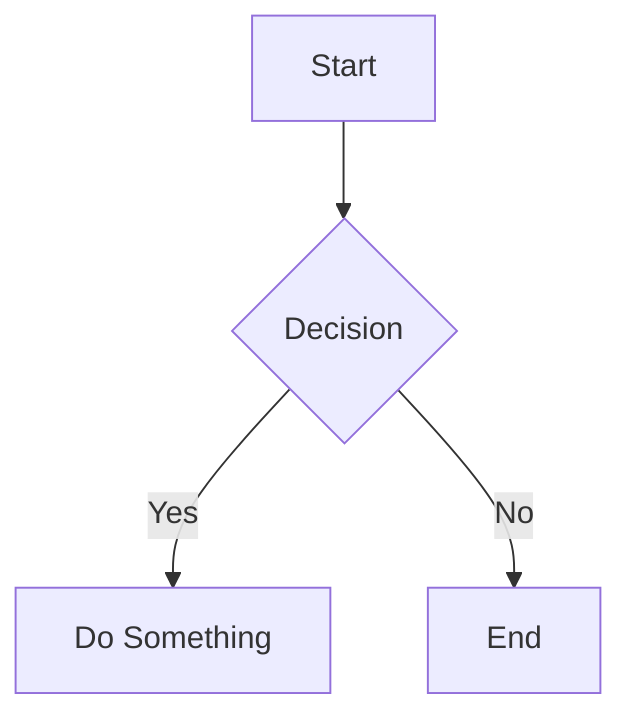

# Mermaid Live Editor

A real-time mermaid diagram editor with live preview and export.

## Features

- **Live Preview** — See your diagram update as you type
- **Diagram Types** — Supports flowchart, sequence, class, state, ER, gantt, pie, mindmap, timeline, and more
- **Local Storage** — Save multiple diagrams, auto-saves on edit
- **Export** — Download as PNG or SVG
- **Dark Theme** — Built-in dark mode

## Getting Started

```bash
npm install
npm run dev
```

Open http://localhost:5173 in your browser.

## Build

```bash
npm run build
```

Production files are output to `dist/`.

## Usage

Write mermaid syntax in the editor:



The preview updates automatically after you stop typing.
